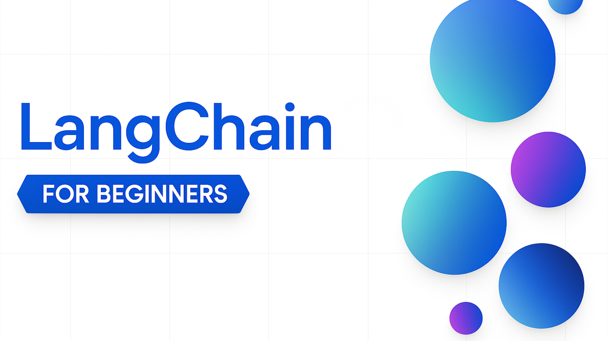

# LangChain for Beginners - A Course

A course teaching everything you need to know to start building AI Agents with LangChain

## 🦜🔗 Getting Started

Welcome to **LangChain for Beginners**! This course has lessons covering the fundamentals of building with LangChain. Each [lesson]() covers its own topic so start wherever you like!

Don't forget to [star (🌟) this repo]() and [fork this repo]() to run the code.

### 👫 Meet Other Learners, Get Your Questions Answered

If you get stuck or have any questions about building AI Agents, join our dedicated Discord Channel in the [Azure AI Foundry Community Discord](https://aka.ms/langchain-foundry/discord).

## 📋 Prerequisites

Before starting this course, you should be comfortable with:

- **Python fundamentals** - Variables, functions, objects, async/await, pip for package installation
- **Basic Generative AI concepts** - Basic understanding of LLMs, prompts, tokens which are covered in our [GenAI for Beginners](https://github.com/microsoft/generative-ai-for-beginners) course

### Required Tools

- [Python 3.12 or later](https://python.org/)
- Code editor ([VS Code recommended](https://code.visualstudio.com/))

### Acessing LLMs

Each lesson in this course includes code examples, which can be found in the code_samples folder. You can [fork this repo](https://github.com/microsoft/langchain-for-beginners/fork) to create your own copy.  

The code example in these exercises, utilize Azure AI Foundry and GitHub Model Catalogs for interacting with Language Models:

- [Github Models](https://aka.ms/ai-agents-beginners/github-models) - Free / Limited
- [Azure AI Foundry](https://aka.ms/ai-agents-beginners/ai-foundry) - Azure Account Required

For more information on running the code for this course, go to the [Course Setup](./00-course-setup/README.md).

## 🙏 Want to help?

Do you have suggestions or found spelling or code errors? [Raise an issue](https://github.com/microsoft/langchain-for-beginners/issues) or [Create a pull request](https://github.com/microsoft/langchain-for-beginners/pull). 

## 📂 Each lesson includes

- A written lesson located in the README and a short video
- Python code samples supporting Azure AI Foundry and Github Models (Free)
- Links to extra resources to continue your learning

---
## 🗃️ Lessons

| #  | **Lesson**                                   | **Text & Code**                                    | **Video**                                                  | **Extra Learning**                                                                     |
|----|----------------------------------------------|----------------------------------------------------|------------------------------------------------------------|----------------------------------------------------------------------------------------|
| 0  | Course Setup                                 | [Link](./00-course-setup/README.md)                | [Video]()  | [Link]() |
| 1  | Intro to LangChain and Agent Use Cases       | [Link](./01-introduction/README.md)                | [Video]()  | [Link]() |
| 2  | Chat Models & Basic Interactions             | [Link](./02-chat-models/README.md)                 | [Video]()  | [Link]() |
| 3  | Prompts, Messages, and Structured Outputs    | [Link](./03-prompts-messages-outputs/README.md)    | [Video]()  | [Link]() |
| 4  | Function Calling & Tools                     | [Link](./04-function-calling-tools/README.md)      | [Video]()  | [Link]() |
| 5  | Getting Started with Agents                  | [Link](./05-agents/README.md)                      | [Video]()  | [Link]() |
| 6  | Model Context Protocol (MCP)                 | [Link](./06-mcp/README.md)                         | [Video]() | [Link]() |
| 7  | Documents, Embeddings & Semantic Search      | [Link](./07-documents-embeddings-semantic-search/README.md) | [Video]()  | [Link]() |
| 8  | Building Agentic RAG Systems                 | [Link](./08-agentic-rag-systems/README.md)         | [Video]()  | [Link]() |
|    |                                                                                                |                                                            

We're planning to expand this course over time with additional topics as well. Stay tuned for updates!

---

## 📖 Course Resources and Additional Samples

- **[Glossary](./GLOSSARY.md)** - Comprehensive definitions of all terms used throughout the course
- **[LangChain Documentation](https://docs.langchain.com/oss/python/langchain/overview)** - Official LangChain docs for deeper dives
- **[Email Agent Sample](https://github.com/microsoft/ai-agents-for-beginners-sample)** - Learn how to build an email agent with LangChain and MCP 
---

## Additional Resources 

### Azure / Edge / MCP / Agents

---
 
### Generative AI Series

[-9333EA?style=for-the-badge&labelColor=E5E7EB&color=9333EA)](https://github.com/microsoft/Generative-AI-for-beginners-dotnet?WT.mc_id=academic-105485-koreyst)
[-C084FC?style=for-the-badge&labelColor=E5E7EB&color=C084FC)](https://github.com/microsoft/generative-ai-for-beginners-java?WT.mc_id=academic-105485-koreyst)
[-E879F9?style=for-the-badge&labelColor=E5E7EB&color=E879F9)](https://github.com/microsoft/generative-ai-with-javascript?WT.mc_id=academic-105485-koreyst)

---
 
### Core Learning

---
 
### Copilot Series

---

## Getting Help

If you get stuck or have any questions about building AI apps, join:

If you have product feedback or errors while building visit:

---

## Contributing

This project welcomes contributions and suggestions.  Most contributions require you to agree to a Contributor License Agreement (CLA) declaring that you have the right to, and actually do, grant us the rights to use your contribution. For details, visit <https://cla.opensource.microsoft.com>.

When you submit a pull request, a CLA bot will automatically determine whether you need to provide a CLA and decorate the PR appropriately (e.g., status check, comment). Simply follow the instructions provided by the bot. You will only need to do this once across all repos using our CLA.

This project has adopted the [Microsoft Open Source Code of Conduct](https://opensource.microsoft.com/codeofconduct/). For more information see the [Code of Conduct FAQ](https://opensource.microsoft.com/codeofconduct/faq/) or contact [opencode@microsoft.com](mailto:opencode@microsoft.com) with any additional questions or comments.

## Trademarks

This project may contain trademarks or logos for projects, products, or services. Authorized use of Microsoft trademarks or logos is subject to and must follow [Microsoft's Trademark & Brand Guidelines](https://www.microsoft.com/legal/intellectualproperty/trademarks/usage/general). Use of Microsoft trademarks or logos in modified versions of this project must not cause confusion or imply Microsoft sponsorship. Any use of third-party trademarks or logos is subject to those third-parties' policies.

